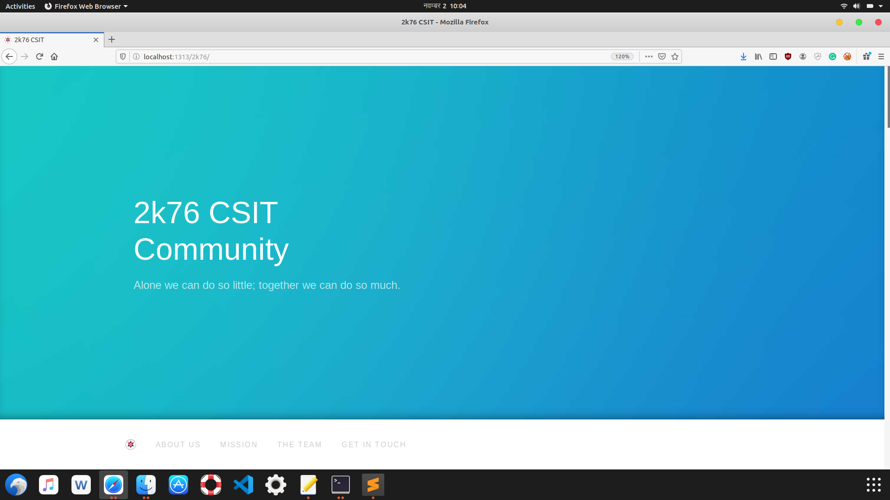
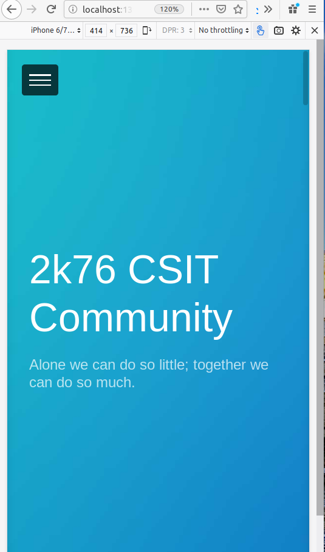

# 2k76 Community

### Goals

- Encouraging CS students in open source
- Growing together in tech
- Becoming more productive

The site is open source. 

**Note for contributors.** If you want to make a pull request , Please read CONTRIBUTING.md

Submit [issues](https://github.com/Aju100/2k76/issues/new) and [pull requests](https://github.com/Aju100/2k76/compare?expand=1) for stories, site ideas.

## Screenshots
#### Desktop View

#### Moblie View

## Contributors ✨

Thanks goes to these wonderful people:
<table>
	<tr>
		<td align="center">
			<a href="https://github.com/Aju100"> <b>Aju Tamang</b></a> 
		</td>
	</tr>
</table>

Contributions of any kind welcome!

## License
This work is released under [MIT License][MIT]

[MIT]:https://github.com/Aju100/2k76/blob/master/LICENSE